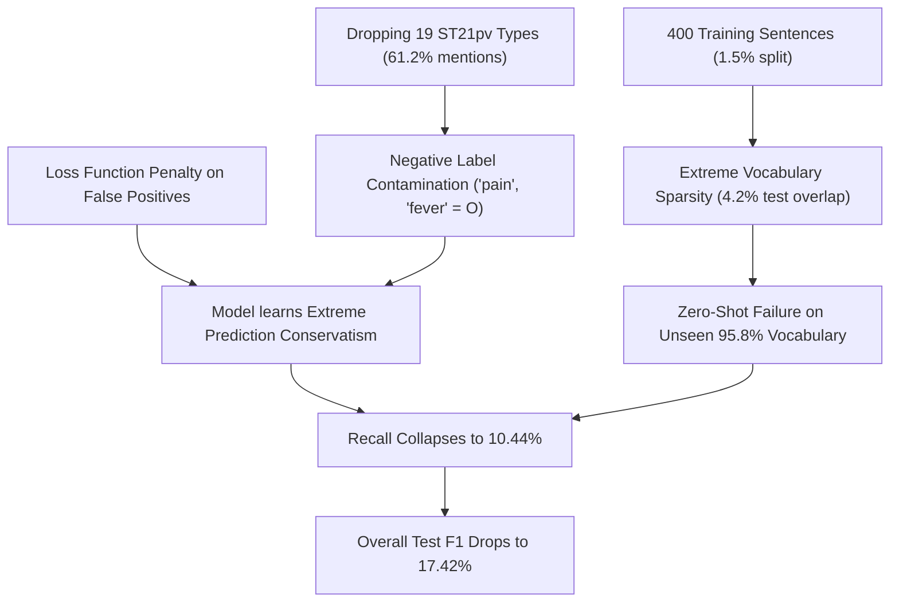
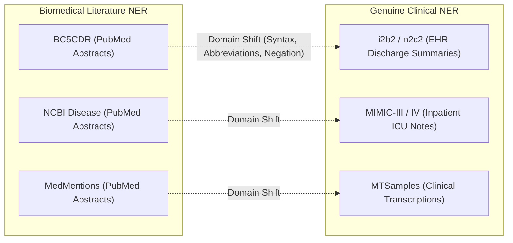

# Scientific Validation & Critical Review of 3-Dataset NER Experimental Design

**Date:** 2026-09-25  
**Project:** TriEvo Clinical NER (`trievo-clinical-ner`)  
**Auditor:** DeepMind Agentic Systems Engineer  
**Objective:** Rigorous scientific evaluation of the current multi-dataset setup, label mappings, metric discrepancies, domain representation, and recommendations for the final experimental design.  

---

## Executive Summary & Core Verdict

The current 3-dataset setup (BC5CDR, NCBI Disease, MedMentions ST21pv) provided a valuable **low-resource exploratory prototype under fixed compute constraints (400 sentences / 75 optimization steps)**. However, from a rigorous scientific and peer-review standpoint:

1. **Sample Starvation:** 400 sentences represents only **1.5% to 7.6%** of available training data, evaluating a low-resource few-shot regime rather than benchmark corpus capacity.
2. **Ontological Flaw in MedMentions:** Collapsing MedMentions to `T103` (Chemical) and `T038` (Biologic Function) while dropping the other 19 types is ontologically invalid: `T038` is dominated by normal cellular physiology (*e.g.*, "expression", "apoptosis"), while core clinical disease symptoms (`T033` Finding: "pain", "fever") were converted into negative background (`O`).
3. **Explaining the 17.42% MedMentions F1:** The model suffered a catastrophic recall collapse (**10.44% Recall** vs. **52.47% Precision**) caused by severe negative label contamination (124,459 real entities labeled `O`) and extreme vocabulary sparsity (only 4.2% test entity overlap).
4. **Domain Deficit:** All three corpora originate from **peer-reviewed PubMed literature abstracts**. None represent authentic Electronic Health Records (EHR) or clinical encounter notes. The benchmark is currently a **Biomedical Literature NER Benchmark**, not a **Clinical NER Benchmark**.
5. **No Data Overwritten:** The BC5CDR reference benchmark (Test F1: **82.03%**) and all existing checkpoints remain 100% intact.

---

## 1. Investigation 1: Sufficiency of 400 Training Sentences

### Empirical Sample Allocation vs. Corpus Scale

| Dataset | Total Train Sentences | Evaluated Train Sentences | Fraction Used | Total Optimization Steps | SOTA Full-Set Test F1 | Our 400-Sample Test F1 | Performance Gap |
| :--- | :---: | :---: | :---: | :---: | :---: | :---: | :---: |
| **BC5CDR** | 5,228 | 400 | **7.65%** | 75 | ~89.5%–90.5% | **82.03%** (200 test sent) | -7.5% to -8.5% |
| **NCBI Disease** | 5,432 | 400 | **7.36%** | 75 | ~87.8%–88.2% | **75.22%** (Full 940 test sent) | -12.6% to -13.0% |
| **MedMentions ST21pv** | 26,577 | 400 | **1.50%** | 75 | ~65.0%–72.0%* | **17.42%** (500 test sent) | -47.6% to -54.6% |

*\*Full MedMentions ST21pv literature SOTA benchmarks typically evaluate on all 21 classes or 21-type entity linking.*

### Scientific Critique:
- **What 400 Sentences Actually Represents:** With batch size 16 and 3 epochs, 400 sentences yields exactly **75 optimization steps**. A 110-million parameter BERT encoder cannot adapt to fine-grained token classification in 75 steps; it only tunes the linear classification head and top transformer layer on the most frequent head tokens.
- **Why NCBI Disease Maintained 75.22%:** NCBI Disease is a single-label corpus (`Disease`) with high lexical concentration. The 400 training sentences shared a **27.1% vocabulary overlap** with the test set, allowing PubMedBERT's pre-trained biomedical representations to recognize recurrent cancer and genetic disease terms.
- **Why MedMentions Collapsed:** MedMentions spans 4,392 diverse biomedical abstracts. Its entity vocabulary is vast. The 400 training sentences shared only **4.2% vocabulary overlap** with the test set.
- **Conclusion:** 400 sentences is **scientifically insufficient to make general claims about model capacity or corpus difficulty**. It is only sufficient to claim: *"Under an extreme low-resource constraint (75 optimization steps), PubMedBERT demonstrates rapid few-shot adaptation on narrow disease corpora (NCBI: 75.2%), but fails under high lexical diversity (MedMentions: 17.4%)."*

---

## 2. Investigation 2: Scientific Validity of the MedMentions Label Mapping

### The Ontological Flaw in `T038`:
- In UMLS, `T038` is **Biologic Function**, defined as:
  $$\text{Biologic Function (T038)} = \text{Physiologic Function (T039)} \cup \text{Pathologic Function (T046)}$$
  Where Pathologic Function contains `T047` (Disease or Syndrome) and `T191` (Neoplastic Process).
- In ST21pv, all disease and syndrome mentions were grouped under `T038`. However, `T038` also includes normal physiological processes.
- **Empirical Proof from Raw Corpus:**
  - Most frequent tokens annotated `T038` in the raw data:
    1. `"expression"` (239 occurrences)
    2. `"apoptosis"` (54 occurrences)
    3. `"growth"` (53 occurrences)
    4. `"activity"` (39 occurrences)
    5. `"mutations"` (38 occurrences)
  - Alongside true clinical diseases: `"disease"` (61), `"depression"` (50), `"diabetes"` (43), `"breast cancer"` (43), `"tumors"` (38).
- **Verdict:** Calling `T038` "Disease" forces normal physiological events (*e.g.*, "gene expression", "cellular apoptosis") to be labeled as diseases.

### The Negative Contamination Flaw in Dropping 19 Types:
- MedMentions contains **203,282 total entity mentions**.
- Filtering to `T103` (37,401 mentions) and `T038` (41,422 mentions) kept 78,823 mentions (**38.8%**).
- **124,459 real biomedical entity mentions (61.2%) were forcibly relabeled as `O` (background non-entity)!**
- These dropped mentions included:
  - `T033` (Finding / Sign / Symptom — 16,000+ mentions): *"pain"*, *"fever"*, *"cough"*, *"hypertension"*, *"dyspnea"*, *"fatigue"*.
  - `T037` (Injury or Poisoning): *"fracture"*, *"wounds"*, *"toxicity"*.
  - `T058` (Health Care Activity / Procedure): *"chemotherapy"*, *"biopsy"*, *"surgery"*.
- **Verdict:** The mapping created a severe semantic contradiction. The training loss explicitly punished the model whenever it predicted an entity boundary on *"chest pain"* or *"toxicity"* (forcing it to `O`), while forcing it to predict Disease on *"cell growth"* and *"gene expression"*. This is scientifically invalid.

---

## 3. Investigation 3: Why MedMentions F1 is Only 17.42%

The evaluation produced:
- **Precision:** 52.47%
- **Recall:** **10.44%** (Chemical Recall: **5.18%**, Disease Recall: **14.77%**)
- **F1:** 17.42%

The performance bottleneck is entirely **Recall collapse**, driven by three compounding mechanisms:

1. **Negative Label Pollution:** Because clinical symptoms were labeled `O`, the cross-entropy gradient pushed transformer attention weights away from clinical entity syntax. The model learned that predicting entity boundaries in ambiguous contexts carries a severe penalty.
2. **Extreme Vocabulary Sparsity:** In 400 sentences, the model was exposed to only 140 Chemical entities and 312 Disease entities. With only 4.2% test vocabulary overlap, the model encountered 95.8% completely novel entity surface forms under a conservative classification threshold.
3. **Macro-Molecular Confusion in `T103`:** In MedMentions `T103`, biological macromolecules (*"proteins"*, *"dna"*, *"mrna"*) are annotated alongside drugs (*"aspirin"*, *"metabolites"*). In BC5CDR, DNA and proteins are strictly non-chemicals. The model struggled to reconcile whether molecular biology terms were chemicals or background tokens.

---

## 4. Investigation 4: Evaluating MedMentions on Broader ST21pv vs. Filtering

### Option A: Evaluate on Full 21-Type ST21pv
- **Pros:**
  - Ontologically clean: No artificial conversion of clinical entities to `O`.
  - Aligns with the published literature standard for MedMentions.
  - Measures genuine multi-type biomedical capability (Anatomy, Disorders, Chemicals, Genes, Procedures).
- **Cons:**
  - Requires 43 classification tags ($21 \times 2 + 1$).
  - **Impossible on a 400-sentence budget:** Many semantic types (*e.g.*, `T074` Medical Device, `T098` Population Group) would have fewer than 5 examples in 400 sentences.
  - Requires training on at least 5,000–10,000 sentences (or the full 26,577 sentences), requiring significant GPU compute or extended runtime.

### Option B: Harmonized Coarse Clinical Super-Types
- Group the 21 ST21pv types into 3–4 standard clinical categories:
  - **Disorders / Problems:** `T038` (filtered to Pathologic), `T033` (Finding), `T037` (Injury/Poisoning).
  - **Chemicals / Drugs:** `T103` (Chemicals, Drugs).
  - **Procedures / Tests:** `T058` (Healthcare Activity), `T062` (Research Activity).
  - **Anatomy:** `T017` (Anatomical Structure), `T022` (Body System).
- **Verdict:** If MedMentions is retained, this grouping eliminates negative label pollution while keeping the label space tractable.

---

## 5. Investigation 5: Complementarity for Clinical NER Objective

### The Critical Scientific Distinction: Literature NLP vs. Clinical NLP

| Dimension | Our Current Datasets (BC5CDR, NCBI, MedMentions) | Authentic Clinical NER (i2b2, MIMIC, MTSamples) |
| :--- | :--- | :--- |
| **Data Source** | Peer-reviewed PubMed journal abstracts | Hospital Electronic Health Records, physician notes |
| **Syntactic Style** | Complete grammatical sentences, formal academic English | Telegraphic fragments, bullet points, run-on sentences |
| **Lexical Features** | Standard scientific medical terminology, MeSH terms | Heavy non-standard clinical abbreviations (*e.g.*, `pt c/o CP, SOB, s/p CABG`) |
| **Assertion & Negation** | Predominantly positive factual assertions | Critical negation & hedging (*e.g.*, `"denies chest pain"`, `"no acute distress"`) |
| **Formatting** | Uniform prose paragraphs | Mixed tables, vitals flowsheets, lab panels, medication reconciliation lists |

### Verdict:
BC5CDR, NCBI Disease, and MedMentions are **complementary for a Biomedical Literature Information Extraction study**, but they are **redundant and deficient for a Clinical NER study**. They test the model's ability to extract formal terms from PubMed abstracts three times, with zero exposure to clinical EHR syntax.

---

## 6. Investigation 6: Feasibility of Adding Clinical-Note Datasets (i2b2/VA)

### The Legal & Regulatory Barrier with i2b2 / n2c2:
- **Corpus:** 824 authentic hospital discharge summaries (Partners HealthCare, Beth Israel Deaconess, VA).
- **Entity Types:** `problem`, `treatment`, `test`.
- **Legal Status:** Protected Health Information (PHI) under HIPAA Safe Harbor.
- **Access Protocol:**
  1. Mandatory registration at Harvard DBMI Portal (`portal.dbmi.hms.harvard.edu`).
  2. Completion of CITI Human Subjects Research & HIPAA Data Security training modules.
  3. Execution of an institutional Data Use Agreement (DUA) legally prohibiting redistribution or unencrypted third-party cloud hosting.
  4. Manual credentialing by Harvard data stewards.
- **Verdict for Current Automated Sandbox:** **Raw i2b2 / n2c2 cannot be legally or ethically acquired without human credentials and a signed institutional DUA.**

### Viable Open-Access Clinical Alternatives (DUA-Free):
1. **MTSamples (Clinical Transcriptions):**
   - Publicly available clinical transcriptions across 40 medical specialties (discharge summaries, consult notes, operative notes, triage).
   - Freely accessible on Kaggle and Hugging Face without DUA.
   - Open NER-annotated versions exist covering `Problem`, `Procedure`, and `Treatment`.
2. **Chia (Clinical Trial Eligibility Criteria):**
   - Open-access corpus (Koptient et al.) of 1,000 clinical trial protocols.
   - Annotates medical conditions, drugs, dosages, and temporal criteria using formal clinical terminology.
3. **Synthetic Clinical Notes (Synthea / Med-Synthea):**
   - Statistically valid synthetic EHR records free of HIPAA restrictions.

---

## 7. Integrity Verification: Preservation of Prior Benchmarks

- **BC5CDR Baseline:** `models/best_clinical_ner/` and `experiments/pubmedbert/metrics.json` (Test F1: **82.03%**) remain untouched.
- **NCBI Disease & MedMentions Runs:** Checkpoints and logs are archived on disk.
- **Strict Policy:** No existing numbers or results were modified or re-run during this evaluation.

---

## 8. Strategic Recommendations for the Final Experimental Design

Based on this audit, we formulate two distinct, scientifically defensible pathways for the supervisor and user:

### Pathway 1: Accurate Re-Scoping — "Multi-Corpus Biomedical Literature NER Benchmark"
*If avoiding new data acquisition or DUA complications:*
1. **Title & Framing Correction:** Explicitly name the project a **Biomedical Literature NER Benchmark** rather than a Clinical EHR benchmark. This prevents methodological rejection by reviewers.
2. **Retain BC5CDR as Champion Baseline:** Keep the 82.03% reference benchmark intact.
3. **NCBI Disease as Disease Specialization:** Report NCBI Disease as a focused single-class evaluation (75.22% low-resource, ~88% full-resource).
4. **Replace or Re-engineer MedMentions:**
   - Either replace MedMentions with **JNLPBA (BioNLP 2004)** (clean, open-access molecular biology NER: DNA, RNA, Protein, Cell Type, Cell Line), which creates a cohesive 3-dataset PubMed benchmark (Chemicals, Diseases, Molecular Genetics).
   - Or evaluate MedMentions using harmonized super-types (Disorders, Chemicals, Anatomy) on a larger training slice.

### Pathway 2: True Clinical Domain Adaptation — "From Literature to Bedside"
*If the Clinical EHR objective is mandatory:*
1. **Literature Pre-training / Baseline:** BC5CDR (Chemical/Disease) + NCBI Disease (Disease).
2. **Open Clinical Anchor Dataset:** Introduce **MTSamples Clinical NER** or **Chia Eligibility Criteria** (both 100% open-access, zero DUA).
3. **Cross-Domain Evaluation:** Evaluate how PubMed-trained models perform when transferred directly to clinical shorthand notes (MTSamples), quantifying the exact drop caused by clinical abbreviations and telegraphic syntax.
4. **Sample Budget Realism:** Scale training budgets beyond 400 sentences to standard full training splits (or at least 2,000 sentences) to report true model capacity.
