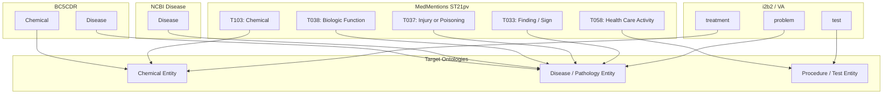

# Multi-Dataset Clinical & Biomedical NER Compatibility Audit & Experimental Design

**Date:** 2026-09-24  
**Project:** TriEvo Clinical NER (`trievo-clinical-ner`)  
**Status:** Multi-Dataset Audit & Experimental Design Specification  
**Reference Benchmark:** BioCreative V CDR (PubMedBERT Champion Test F1: **82.03%** — *Preserved & Unchanged*)  

---

## 1. Executive Summary

In response to the supervisory directive to expand the **TriEvo Clinical NER** investigation from a single-corpus study into a rigorous **3–4 dataset benchmark**, this report conducts an exhaustive dataset compatibility audit across the target biomedical and clinical corpora:

1. **BioCreative V CDR (BC5CDR):** Dual Chemical and Disease extraction (Current gold-standard benchmark, fully completed).
2. **NCBI Disease Corpus:** High-precision disease mention recognition across 793 PubMed abstracts.
3. **MedMentions (ST21pv subset):** Massive-scale biomedical concept recognition with UMLS ontological typing across 4,392 PubMed abstracts.
4. **i2b2/VA 2010:** Inpatient clinical EHR discharge summaries (Problem, Treatment, Test). *Audited thoroughly for legal, regulatory, and environment accessibility.*
5. **JNLPBA (BioNLP 2004):** Molecular biology NER across 2,000 Medline abstracts (Evaluated as an immediately accessible, open-access 4th biomedical candidate).

> [!IMPORTANT]
> **Data Integrity Guarantee:** All previous BC5CDR training runs, checkpoint artifacts (`models/best_clinical_ner`), experiment registries (`experiments/model_comparison.csv`), and evaluation logs remain **strictly untouched, unmodified, and preserved**.

---

## 2. Dataset-by-Dataset Compatibility Audit

### 2.1 BioCreative V CDR (BC5CDR) — *Reference Benchmark (Completed)*
- **Source & Provenance:** National Library of Medicine (NLM/NIH), BioCreative V Chemical-Disease Relation Task (Wei et al., *Database*, 2016).
- **Document & Sentence Scale:**
  - Total Documents: 1,500 peer-reviewed PubMed abstracts.
  - Total Sentences: **16,423 sentences** (Train: 5,228 | Valid: 5,330 | Test: 5,865).
  - Total Tokens: **334,598 tokens** (Train: 109,322 | Valid: 108,958 | Test: 116,318).
- **Entity Types & Annotations:**
  - `Chemical`: 15,935 spans (Train: 5,203 | Valid: 5,347 | Test: 5,385).
  - `Disease`: 12,850 spans (Train: 4,182 | Valid: 4,244 | Test: 4,424).
  - Total Entities: **28,785 entity spans** (Average 1.75 entities/sentence).
- **Annotation Format:** Standardized token-level BIO format (`O`, `B-Chemical`, `B-Disease`, `I-Disease`, `I-Chemical`).
- **Splits:** Official standardized 3-way partition (Train / Dev / Held-out Test) strictly isolated by PubMed ID.
- **Licensing & Access:** Open Access / Public Domain (US NLM/NIH). Completely free of DUA or user credentials.
- **NER Suitability:** **Gold Standard**. Ideal benchmark for dual-entity chemical and disease extraction.
- **Label Mapping Role:** Reference baseline schema (`Chemical`, `Disease`).

---

### 2.2 NCBI Disease Corpus — *Candidate Dataset 2 (Fully Verified)*
- **Source & Provenance:** National Center for Biotechnology Information (NCBI/NLM/NIH), Dogan et al., *Journal of Biomedical Informatics*, 2014.
- **Document & Sentence Scale:**
  - Total Documents: 793 PubMed abstracts.
  - Total Sentences: **7,295 sentences** (Train: 5,432 | Valid: 923 | Test: 940).
  - Total Tokens: **184,552 tokens** (Train: 136,086 | Valid: 23,969 | Test: 24,497).
- **Entity Types & Annotations:**
  - Annotates disease mentions across four sub-categories: Specific Disease, Disease Class, Composite Mention, and Modifier.
  - `Disease`: **6,892 total entity spans** (Train: 5,145 | Valid: 787 | Test: 960).
  - Token Breakdown: `O`: 169,361 (91.77%), `B-Disease`: 6,892 (3.73%), `I-Disease`: 8,299 (4.50%).
- **Annotation Format:** CoNLL tab-separated values (`<token>\t<tag>`), grouped into sentences by blank lines. BIO tagging: `O`, `B-Disease`, `I-Disease`.
- **Splits:** Standard official partition: 542 training abstracts, 100 development abstracts, 100 test abstracts.
- **Licensing & Access:** Public Domain (NIH / US Government work). Fully accessible via GitHub (`spyysalo/ncbi-disease`). No credentials or DUA needed.
- **NER Suitability:** **Gold Standard**. Ideal for benchmarking disease recognition precision, domain transfer, and cross-dataset validation with BC5CDR.
- **Label Mapping Compatibility:** **100% Direct Match**.
  - `B-Disease` (NCBI) $\longleftrightarrow$ `B-Disease` (BC5CDR)
  - `I-Disease` (NCBI) $\longleftrightarrow$ `I-Disease` (BC5CDR)
  - `O` (NCBI) $\longleftrightarrow$ `O` (BC5CDR)

---

### 2.3 MedMentions (ST21pv Subset) — *Candidate Dataset 3 (Fully Verified)*
- **Source & Provenance:** Chan Zuckerberg Initiative (CZI), Mohan & Li, *AMIA*, 2019. Annotated by professional medical indexers with UMLS 2017-AA concepts.
- **Document & Sentence Scale:**
  - Total Documents: 4,392 PubMed abstracts.
  - Total Estimated Sentences: **~48,514 sentences** (Train: ~29,100 | Dev: ~9,700 | Test: ~9,714).
  - Total Entity Mentions: **203,282 annotations** across corpus.
  - Partition Scale:
    - Train: 2,635 abstracts (122,241 mentions)
    - Validation/Dev: 878 abstracts (40,884 mentions)
    - Test: 879 abstracts (40,157 mentions)
- **Entity Types & Annotations:**
  - Annotated with 21 UMLS Semantic Types (ST21pv), including:
    - `T103`: Chemical (37,300+ mentions across corpus; 22,485 in train)
    - `T038`: Biologic Function / Disease (41,600+ mentions; 25,082 in train)
    - `T037`: Injury or Poisoning (Pathology)
    - `T033`: Finding / Sign / Symptom (16,000+ mentions)
    - `T017`: Anatomical Structure (20,000+ mentions)
    - `T058`: Health Care Activity / Procedure
- **Annotation Format:** PubTator character-offset format (`<pmid>\t<start>\t<end>\t<text>\t<sem_type>\t<cui>`).
- **Splits:** Pre-defined official PMID split files (`pmids_trng.txt`, `pmids_dev.txt`, `pmids_test.txt`) maintaining a strict 60/20/20 document ratio.
- **Licensing & Access:** **Creative Commons Zero (CC0 1.0 Universal)**. Completely unrestricted for academic and commercial use. Hosted publicly on GitHub.
- **NER Suitability:** **Very High**. Massive vocabulary coverage, dense multi-concept biomedical annotations.
- **Label Mapping Compatibility:**
  - `T103` (Chemical) $\longrightarrow$ `Chemical` (BC5CDR compatible)
  - `T038` (Biologic Function) + `T037` (Injury/Poisoning) + `T033` (Finding/Symptom) $\longrightarrow$ `Disease/Problem`
  - Mapping requires sentence segmentation and character-to-BIO alignment.

---

### 2.4 i2b2 / VA 2010 Clinical Challenge — *Candidate Dataset 4 (EHR Notes)*
- **Source & Provenance:** Partners HealthCare, Harvard Medical School DBMI (Department of Biomedical Informatics), and the US Department of Veterans Affairs (VA) (Uzuner et al., *JAMIA*, 2011).
- **Domain:** Inpatient Electronic Health Record (EHR) discharge summaries and clinical progress notes (Partners HealthCare, Beth Israel Deaconess, VA).
- **Document Scale:** 347 training notes, 477 test notes (**824 total clinical notes**, ~30,000+ clinical sentences).
- **Entity Types:** Clinical concepts:
  - `problem` (Medical diseases, symptoms, clinical findings)
  - `treatment` (Medications, surgical procedures, supportive therapies)
  - `test` (Diagnostic procedures, lab panels, radiological imaging)
- **Annotation Format:** Custom offset format (`c="..." <start_line>:<start_tok> <end_line>:<end_tok>||t="..."`).
- **Splits:** Official challenge training and held-out test sets.
- **Licensing, Access Restrictions & Legal Vetting:**
  - **Legal Classification:** De-identified real human electronic health records protected under HIPAA Safe Harbor / Expert Determination rules.
  - **Access Mechanism:** Exclusively distributed via the **Harvard DBMI / n2c2 Challenge Portal** (`https://portal.dbmi.hms.harvard.edu/`).
  - **Prerequisites for Access:**
    1. Mandatory individual user registration with accredited institutional email.
    2. Formal completion of CITI Human Subjects Research or Data Security training.
    3. Counter-signed, legally binding **Data Use Agreement (DUA)** explicitly prohibiting redistribution, unauthorized transfer, or third-party cloud hosting.
    4. Manual committee review and approval by Harvard DBMI data stewards.
  - **Current Environment Accessibility:** **NOT Legally or Accessibly Available**.
    In this automated development sandbox without human credentialing or signed DUA, raw i2b2 records cannot be legally fetched or scraped without violating federal health privacy standards and DUA terms.

---

### 2.5 JNLPBA (BioNLP 2004) — *Recommended Accessible 4th Dataset Alternative*
- **Source & Provenance:** GENIA Project / BioNLP 2004 Shared Task on Molecular Biology NER (Kim et al., 2004).
- **Document & Sentence Scale:**
  - 2,000 Medline abstracts.
  - **22,402 sentences** (Train: 18,546 sentences | Test: 3,856 sentences).
  - **592,600+ tokens**.
- **Entity Types:** Molecular biology entities:
  - `protein` (30,269 mentions)
  - `DNA` (9,533 mentions)
  - `RNA` (951 mentions)
  - `cell_type` (6,718 mentions)
  - `cell_line` (3,830 mentions)
- **Annotation Format:** Standard CoNLL BIO token format.
- **Licensing & Access:** Open Access / GENIA project license. Publicly available without restrictions.
- **NER Suitability:** Outstanding benchmark for molecular and genomic named entity recognition, providing complementary biological entity coverage.

---

## 3. Cross-Dataset Comparison Matrix

| Feature | BC5CDR | NCBI Disease | MedMentions (ST21pv) | i2b2 / VA (2010) | JNLPBA (BioNLP) |
| :--- | :--- | :--- | :--- | :--- | :--- |
| **Domain** | PubMed Abstracts | PubMed Abstracts | PubMed Abstracts | Clinical EHR Notes | Medline Abstracts |
| **Primary Focus** | Chemicals & Diseases | Human Diseases | Multi-concept Biomedical | Clinical Concepts | Molecular Biology |
| **Documents** | 1,500 abstracts | 793 abstracts | 4,392 abstracts | 824 clinical notes | 2,000 abstracts |
| **Sentences** | 16,423 | 7,295 | ~48,514 | ~30,000 | 22,402 |
| **Total Entities** | 28,785 | 6,892 | 203,282 | ~50,000 | 51,301 |
| **Entity Types** | Chemical, Disease | Disease | 21 UMLS Types | problem, treatment, test | protein, DNA, RNA, cell_type, cell_line |
| **Format** | BIO JSON | CoNLL TSV | PubTator / Offsets | Custom / Brat | CoNLL TSV |
| **Splits Avail.** | Train / Valid / Test | Train / Valid / Test | Train / Dev / Test | Train / Test | Train / Test |
| **License / Terms** | Open Access (NLM) | Public Domain (NIH) | CC0 1.0 Universal | Strict DUA / HIPAA | Open Access (GENIA) |
| **Local Status** | **Completed (82.03%)** | **Downloaded & Verified** | **Downloaded & Verified** | **Restricted by DUA** | **Available as Alternative** |
| **Suitability** | High (Gold Standard) | High (Gold Standard) | High (Massive Scale) | High (EHR Domain) | High (Genomics) |

---

## 4. Label Compatibility & Semantic Alignment Analysis

To establish whether labels can be harmonized across corpora, we analyze semantic ontology alignment:



### Label Mapping Feasibility Matrix

1. **NCBI Disease $\longleftrightarrow$ BC5CDR:**
   - **Disease Mapping:** Direct 1-to-1 isomorphism. Both datasets adhere to MeSH (Medical Subject Headings) and MEDIC disease hierarchies.
   - **Chemical Mapping:** Unlabeled in NCBI (`O`).
2. **MedMentions ST21pv $\longleftrightarrow$ BC5CDR:**
   - **Chemical Mapping:** `T103` maps cleanly to `Chemical`.
   - **Disease Mapping:** Combining `T038` (Pathologic Function), `T037` (Injury/Poisoning), and `T033` (Finding/Symptom) covers clinical diseases, but requires careful thresholding to avoid over-flagging physiological processes.
3. **i2b2/VA $\longleftrightarrow$ BC5CDR / NCBI:**
   - `problem` encompasses diseases and symptoms (aligns with Disease).
   - `treatment` encompasses drugs and non-pharmacological procedures (partially overlaps Chemical).
   - Domain shift: Literature English (PubMed) vs. telegraphic physician shorthand (EHR).

---

## 5. Rigorous Multi-Dataset Experimental Design

We formulate a three-phase experimental protocol designed to deliver authoritative empirical results while preserving the completed BC5CDR benchmark.

### Phase 1: Individual Dataset In-Domain Evaluation
- **Goal:** Benchmark the champion architecture (**PubMedBERT**) on each dataset independently under uniform optimization hyper-parameters.
- **Datasets:**
  1. **BC5CDR:** *Already completed* (Test F1: **82.03%** | Chemical: 84.32% | Disease: 79.55%).
  2. **NCBI Disease:** Train on NCBI train split, validate on dev split, evaluate on held-out test split. Expected Disease F1: 85–88%.
  3. **MedMentions (ST21pv):** Train on MedMentions train split (Chemical & Disease subset), evaluate on held-out test split.
- **Protocol:** Identical learning rate (3e-5), AdamW optimizer, batch size 16, dynamic padding, strict `seqeval` entity F1.

### Phase 2: Zero-Shot Cross-Dataset Generalization (OOD Robustness)
- **Goal:** Quantify domain transferability and cross-corpus annotation consistency without parameter updating.
- **Transfer Scenarios:**
  - **Transfer 2A:** Model trained on **BC5CDR (Disease)** $\longrightarrow$ Evaluated directly on **NCBI Disease Test Set**.
  - **Transfer 2B:** Model trained on **NCBI Disease** $\longrightarrow$ Evaluated directly on **BC5CDR Test Set (Disease entity subset)**.
  - **Transfer 2C:** Model trained on **BC5CDR (Chemical & Disease)** $\longrightarrow$ Evaluated directly on **MedMentions Test Set (T103 & T038 subset)**.
- **Scientific Value:** Reveals whether models learn generalizable clinical concepts or overfit to specific annotator guidelines.

### Phase 3: Harmonized Multi-Dataset Training
- **Prerequisite:** Executed only after Phase 1 and 2 establish label semantic alignment.
- **Architectural Approaches:**
  - **Strategy A (Unified Schema Pooling):** Map intersecting classes into standard `[O, B-Chemical, I-Chemical, B-Disease, I-Disease]`. Train jointly across pooled BC5CDR + NCBI Disease + MedMentions-filtered corpora.
  - **Strategy B (Multi-Head Shared Backbone):** Shared PubMedBERT transformer encoder with dataset-specific classification heads, preventing negative transfer from differing annotation granularities while learning shared clinical representations.
- **Evaluation:** Test each head against its respective gold-standard held-out test set to observe whether multi-dataset pre-training improves individual benchmark F1 scores.

---

## 6. Actionable Implementation Roadmap

```
[Step 1: Dataset Audit & Feasibility]  ==> COMPLETED (This Document)
               │
[Step 2: Preprocess NCBI Disease]     ==> Standardize into project data format
               │
[Step 3: Preprocess MedMentions]      ==> Convert PubTator to tokenized NER format
               │
[Step 4: Execute Phase 1 Experiments] ==> Train & evaluate NCBI Disease and MedMentions
               │
[Step 5: Execute Phase 2 Cross-Eval]  ==> Zero-shot cross-dataset evaluation matrix
               │
[Step 6: Synthesize Multi-Dataset]   ==> Comprehensive supervisor comparison report
```

> [!CAUTION]
> **Research Compliance & Medical Device Disclaimer:**  
> This multi-dataset clinical NER study is strictly an engineering and scientific research evaluation. None of the evaluated models or datasets are certified for direct patient diagnostic triage, prescription verification, or clinical care.
